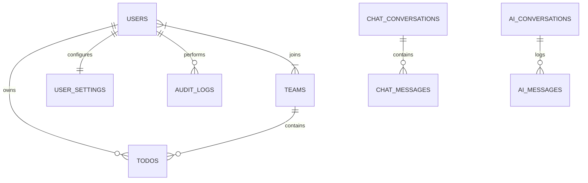

# LAPORAN AKHIR PENGUMPULAN PROYEK
## WUDI Monitoring Dashboard & Task Management Platform

Laporan ini disusun sebagai dokumentasi resmi pengumpulan proyek akhir untuk sistem **WUDI Monitoring Dashboard & Task Management Platform**. Dokumen ini menjabarkan arsitektur, detail implementasi fitur, skema basis data, integrasi AI, serta petunjuk pengoperasian sistem secara menyeluruh.

---

## 📅 Ringkasan Proyek

| Nama Proyek | WUDI Monitoring Dashboard & Task Management Platform |
| :--- | :--- |
| **Teknologi Utama** | Laravel 12 (PHP 8.2), Tailwind CSS v4, Vanilla JavaScript, SQLite |
| **Model AI** | Google Gemini 2.5 Flash API (via WudiAiService) |
| **Integrasi Eksternal** | Google Identity Services (OAuth 2.0), Firebase Cloud Messaging (FCM HTTP v1) |
| **Status Proyek** | **Selesai & Siap Diuji** (Production-ready & fully integrated) |

---

## 1. Pendahuluan & Latar Belakang

**WUDI** adalah platform manajemen tugas (*task management*) kolaboratif berbasis tim yang dirancang untuk produktivitas modern. Untuk memantau aktivitas pengguna, performa server, dan potensi ancaman keamanan secara *real-time*, dikembangkan sebuah **Monitoring Dashboard** terintegrasi khusus untuk administrator (*Admin Panel*).

Dashboard ini memfasilitasi admin dengan visualisasi data yang dinamis, laporan yang dapat diekspor, manajemen pengguna yang terenkripsi, serta **Wudi AI Assistant**—asisten cerdas bertenaga LLM (Gemini 2.5 Flash) yang mampu membaca kondisi dashboard dan log keamanan untuk menjawab kebutuhan admin menggunakan bahasa alami.

---

## 2. Fitur-Fitur Utama Proyek

### 🖥️ 2.1. Panel Utama Monitoring (Real-Time Dashboard)
- **Metrik Utama (Cards):** Menyajikan data pengguna aktif harian/bulanan, jumlah interaksi API, serta status ancaman keamanan secara dinamis.
- **Visualisasi Chart:** Grafik distribusi tugas (*Task Distribution*) dan grafik perkembangan pengguna (*User Growth*) menggunakan SVG/Canvas dinamis yang responsif.
- **Joined Users List:** Menampilkan daftar pengguna terbaru yang bergabung beserta tanggal pendaftaran secara dinamis.

### 🩺 2.2. Polling Kesehatan Sistem (System Health Check)
- Fitur pemantauan otomatis (*polling*) setiap **5 detik** pada halaman **System Analytics** yang memantau:
  - Latensi Database (dalam milidetik/ms).
  - Traffic Request API secara dinamis.
  - Estimasi penggunaan CPU & RAM.
  - Status koneksi WebSocket.
- Memiliki indikator visual berwarna hijau (aman), kuning (peringatan), atau merah (bahaya) sesuai ambang batas beban sistem.

### 📊 2.3. Halaman Analytics (Multi-Kategori)
Sistem memisahkan laporan analisis ke dalam tiga sub-halaman dengan desain bertema "WUDI" yang premium:
1. **Productivity Analytics:** Memantau laju penyelesaian tugas pengguna (*Task Completion Rate*), produktivitas tim, dan visualisasi performa kerja.
2. **Security Analytics:** Melacak anomali masuk (*failed logins*), alamat IP mencurigakan, dan pencatatan audit log keamanan.
3. **System Performance:** Grafik performa server, latensi query database, dan status kesehatan dependensi server.

### 👤 2.4. Access Control & Manajemen Laporan (Report & User Status)
- **Security Actions:** Admin dapat mengubah status pengguna secara langsung (Active, Flagged, Banned, Warning) dengan mengisi formulir alasan audit (*Audit Reason Log*).
- **Fungsi Dinamis:** Dilengkapi fitur Pencarian (*Search*), Filter tanggal, Tombol Refresh instan tanpa muat ulang halaman.
- **Ekspor Data:** Fitur ekspor data tabel ke format **CSV** dan dokumen cetak **PDF** yang rapi dan terformat dengan baik di seluruh halaman tabel.

### 🤖 2.5. Wudi AI Assistant (Gemini 2.5-Flash)
- **Model Upgrade:** Ditingkatkan ke model `gemini-2.5-flash` untuk pemrosesan kalimat yang lebih cepat, natural, dan cerdas.
- **Dynamic Context Parsing:** AI membaca data mentah dari database dashboard (jumlah user, status server, log audit terbaru) untuk memberikan ringkasan (*summary*) yang akurat.
- **Local Chat History:** Percakapan disimpan secara aman di dalam `localStorage` browser sehingga riwayat obrolan tidak hilang saat halaman di-*refresh* atau berpindah rute.
- **Clean Output (No Markdown Symbols):** Menggunakan fungsi pembersih kustom (`cleanMarkdown`) di sisi *frontend* untuk menghapus simbol-simbol pemformatan markdown seperti `**`, `*`, `#`, dll., guna menampilkan pesan teks yang bersih dan mudah dibaca.
- **Avatar Branding:** Desain obrolan terintegrasi penuh menggunakan logo resmi `Logo.png` Wudi.

### 🔐 2.6. Alur Autentikasi Modern
- **Email & OTP Verification:** Pendaftaran akun baru memerlukan verifikasi kode OTP 6-digit dengan timer hitung mundur (*countdown*) untuk kirim ulang OTP.
- **Google OAuth (Google Sign-In):** Integrasi mulus menggunakan Google Identity Services (GIS SDK) di mana pengguna dapat mendaftar atau masuk langsung menggunakan akun Google mereka.
- **Auth Guard:** Pengecekan otentikasi ketat secara *client-side* di layout utama untuk mencegah akses ilegal tanpa token JWT yang valid.

---

## 3. Arsitektur Sistem & Struktur Direktori

Sistem ini dibangun dengan arsitektur monorepo berbasis Laravel, di mana backend REST API dan frontend Blade Template berada dalam satu kesatuan proyek terintegrasi demi kemudahan *deployment*.

```
Dashboard-Monitoring-Wudi/
├── app/
│   ├── AI/                          # Logika & Engine Wudi AI
│   │   ├── Context/                 # Membangun context data dari DB ke prompt AI
│   │   ├── Providers/               # Gemini API Client Provider
│   │   └── Services/                # WudiAiService & AiTaskManager
│   ├── Http/Controllers/            # Controller untuk API & Web Views
│   ├── Models/                      # Model Eloquent (User, Todo, AuditLog, dll)
│   └── Services/                    # MonitoringService untuk pooling data
├── config/                          # File konfigurasi Laravel (jwt, services, dll)
├── database/
│   ├── migrations/                  # Skema tabel database (SQLite/PostgreSQL)
│   └── seeders/                     # Seeder data dummy untuk monitoring
├── docs/                            # Dokumentasi teknis proyek
├── public/
│   ├── Logo.png                     # Logo resmi Wudi
│   └── build/                       # Kompilasi aset CSS (Tailwind v4)
├── resources/
│   ├── css/                         # File sumber stylesheet (app.css)
│   └── views/                       # File template tampilan Laravel Blade
│       ├── auth/                    # Halaman Login, Register, & OTP
│       ├── components/              # Komponen reusable (Sidebar, dll)
│       ├── layouts/                 # Master Layout (app.blade.php)
│       └── *.blade.php              # Halaman Dashboard, Analytics, Report, Settings, Help
├── routes/
│   ├── api.php                      # Rute Endpoint API RESTful
│   └── web.php                      # Rute Halaman Frontend Web
└── README.md                        # Dokumentasi repositori utama
```

---

## 4. Skema Database Utama

Aplikasi menggunakan basis data relasional dengan tabel-tabel utama sebagai berikut:



1. **`users`**: Menyimpan kredensial pengguna, foto profil (*avatar*), zona waktu, dan ID Google.
2. **`todos`**: Menyimpan data tugas, tenggat waktu (*deadline*), prioritas (*high/medium/low*), status penyelesaian, dan relasi tim.
3. **`audit_logs`**: Mencatat aktivitas administrator dan pengguna seperti perubahan status akun, pembuatan data, atau aktivitas masuk mencurigakan.
4. **`ai_conversations` & `ai_messages`**: Menyimpan riwayat percakapan asisten kecerdasan buatan (Wudi AI) secara persisten di server.

---

## 5. Cara Instalasi & Menjalankan Aplikasi di Lokal

Ikuti langkah-langkah berikut untuk menjalankan proyek di komputer Anda:

### 📥 Langkah 1: Kloning Repositori
```bash
git clone https://github.com/Ferdiii06/Dashboard-Monitoring-Wudi.git
cd Dashboard-Monitoring-Wudi
```

### 📦 Langkah 2: Instalasi Dependensi
```bash
# Instal dependensi PHP (Laravel)
composer install

# Instal dependensi Node.js (Vite & Tailwind)
npm install
```

### ⚙️ Langkah 3: Konfigurasi Environment (`.env`)
Salin file konfigurasi contoh dan sesuaikan variabelnya:
```bash
cp .env.example .env
```
Buka file `.env` dan masukkan API Key Gemini Anda:
```env
GEMINI_API_KEY=isi_dengan_gemini_api_key_anda
```

### 🗄️ Langkah 4: Migrasi & Seeding Database
```bash
# Buat file database SQLite kosong jika menggunakan SQLite
touch database/database.sqlite

# Jalankan migrasi tabel
php artisan migrate

# Isi database dengan data dummy monitoring & user admin
php artisan db:seed
```

### 🔑 Langkah 5: Generate Kunci Aplikasi
```bash
php artisan key:generate
php artisan jwt:secret
```

### ⚡ Langkah 6: Kompilasi Aset & Jalankan Server
Buka dua jendela terminal untuk menjalankan proses berikut secara bersamaan:

**Terminal 1 (Laravel Server):**
```bash
php artisan serve
```
*Aplikasi kini dapat diakses melalui browser di alamat [http://127.0.0.1:8000](http://127.0.0.1:8000).*

**Terminal 2 (Kompiler Aset CSS Tailwind):**
```bash
npm run dev
```

---

## 🏆 Kesimpulan
Proyek akhir **WUDI Monitoring Dashboard & Task Management Platform** telah berhasil dikembangkan dengan performa tinggi, keamanan optimal (JWT + Google OAuth), dan pengalaman pengguna (*UX*) yang responsif. Integrasi **Gemini 2.5-Flash** sebagai Wudi AI Assistant memberikan nilai tambah yang inovatif dalam pengelolaan dan analisis sistem berbasis data kecerdasan buatan.

*Laporan ini siap dilampirkan sebagai dokumen pengumpulan proyek akhir.*
